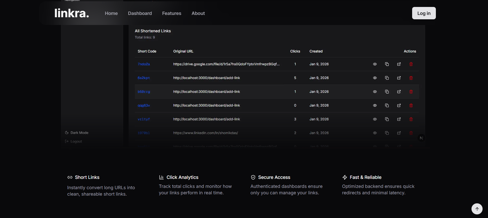
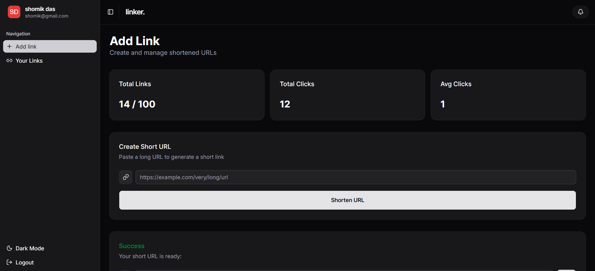
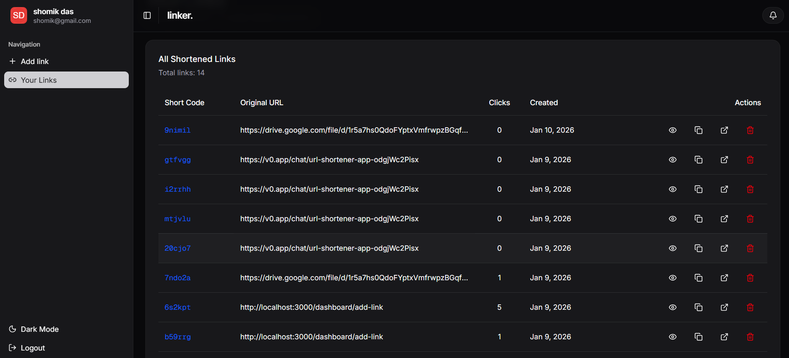

# URL-Shortener

**URL-Shortener** is a full-stack URL shortening platform that allows users to convert long URLs into short, shareable links. Authenticated users can manage their links through a dashboard, track click analytics, and control their shortened URLs — all with a clean and modern interface.

The application is designed with scalability, security, and simplicity in mind, ensuring a smooth experience from link creation to redirection.








## Features

- **User Authentication** – Secure login and signup system using JWT and httpOnly cookies.
- **Protected Dashboard** – Only authenticated users can access and manage their shortened URLs.
- **URL Shortening** – Convert long URLs into unique short links with automatically generated short codes.
- **Short Code Redirection** – Visiting a short URL redirects users to the original long URL.
- **Click Tracking** – Each short URL tracks total number of visits in real time.
- **Usage Limit (Free Tier)** – Users can create up to **100 shortened URLs**. An alert is shown when the limit is reached.
- **Manage URLs** – View all shortened URLs, copy links, and delete URLs from the dashboard.
- **Copy to Clipboard** – Easily copy both short URLs and original URLs with one click.
- **Modern UI** – Clean, responsive interface built using Shadcn/UI and Tailwind CSS.
- **Smooth UX Enhancements** – Includes toast notifications, modals, and smooth scroll-to-top interaction.

## Tech Stack

### Frontend
- **Next.js (App Router)**
- **TypeScript**
- **Shadcn/UI**
- **Tailwind CSS**

### Backend
- **Node.js**
- **Express.js**
- **JWT Authentication**

### Database
- **MongoDB**
- **Mongoose**

## API Endpoints

### Authentication
- `POST /api/auth/signup` – Register a new user
- `POST /api/auth/login` – Login user
- `POST /api/auth/logout` – Logout user

### URL Management
- `POST /api/url/shorten` – Create a shortened URL
- `GET /api/url/my-urls` – Fetch all URLs created by the logged-in user
- `DELETE /api/url/:id` – Delete a shortened URL

### Redirection
- `GET /:shortCode` – Redirect to original URL and increment click count


## Installation & Setup

### Clone the repository
```sh
cd url-shortener

cd server
npm install
npm run dev


cd client
npm install
npm run dev
```


